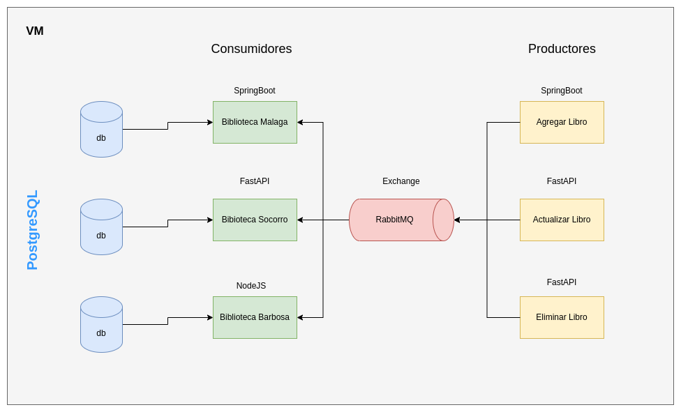

# Proceso de despliege



* A continuacion se dan los pasos a seguir para desplegar la version 1 del proyecto

    ## Pasos iniciales

    1. Ingresar al directorio `Consumidor-FastAPI` y darle permisos de ejecucion al script `wait-for-it.sh`

        ```bash
            sudo apt install chmod +x wait-for-it.sh
        ```
    2. Crear el archivo ejecutable `.jar` del `Consumidor-Sprinboot` y `Productor-Springboot`

        ```bash
            cd .. &&  cd Consumidor-SpringBoot/bibliotecaMalaga
            ./mvnw package
            cd .. &&  cd Productor-SpringBoot/agregarLibro
            ./mvnw package
        ```

        * En caso de no tener instalador `openjdk-17-jdk` debera instalarlo

        ```bash
            sudo apt install openjdk-17-jdk
            # Ver la version de java
            java -version
        ```


    3. Volver a la raiz de la version 1 y ejecutar el `docker-compose.yml`

        ```bash
            cd ../../
            sudo docker-compose up --build
        ```
    
    4. Para probar las diferentes puede usar el archivo .json de solicitudes http modificando el valor `localhost` por la ip de la maquina si no se desplego local 

        [Postman Routes](../Postman/Biblioteca.json)

    
    > **Nota:** Esperar 60 segundos antes de empezar a realizar las pruebas de request
